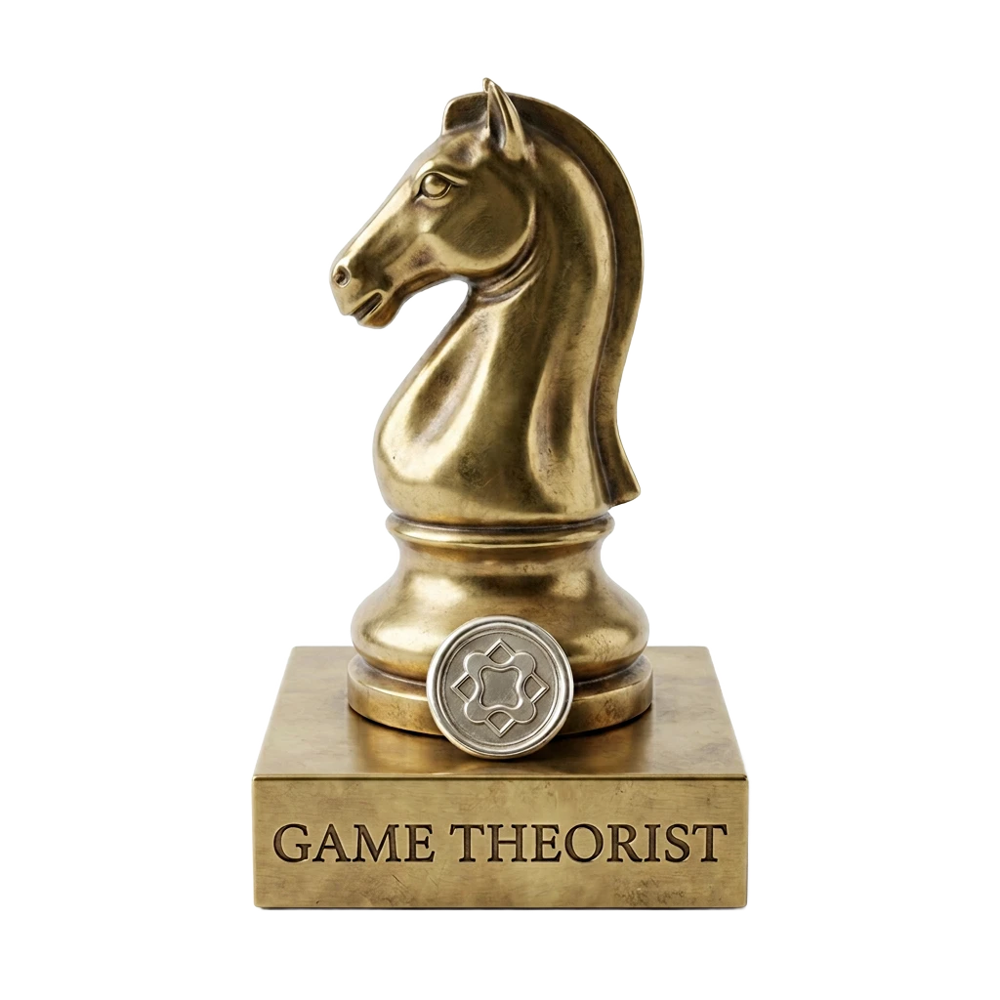
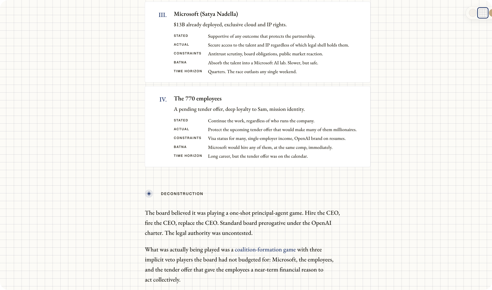
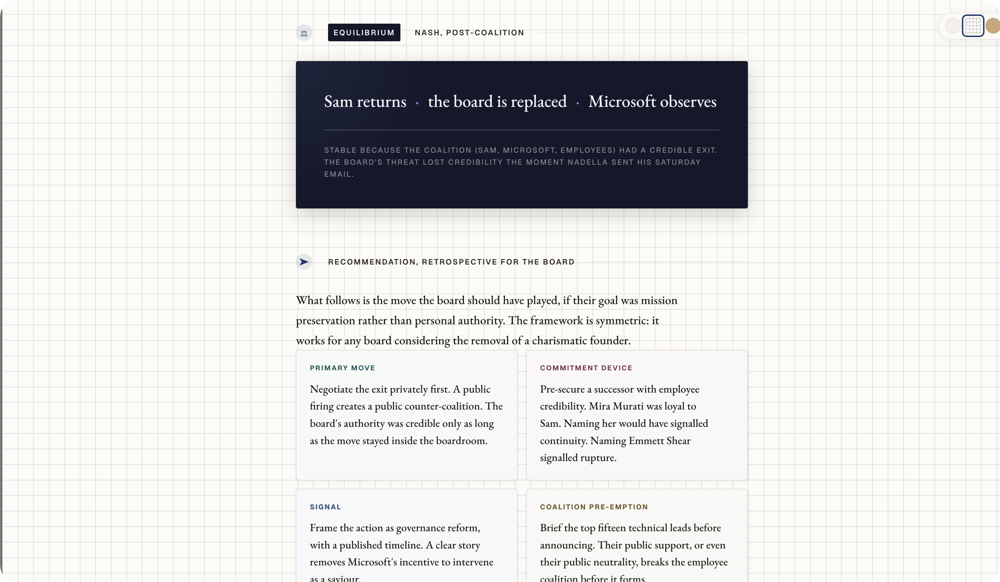
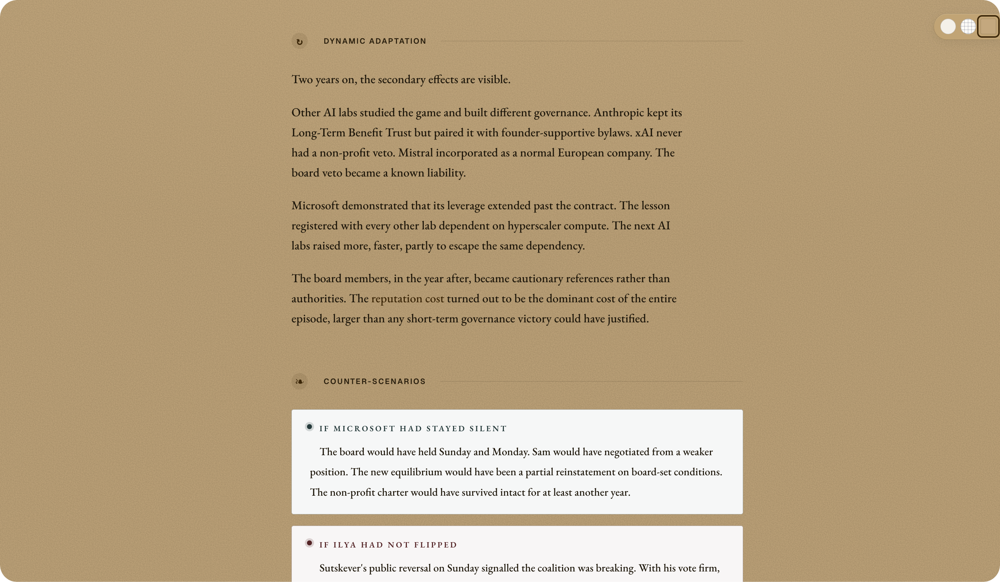
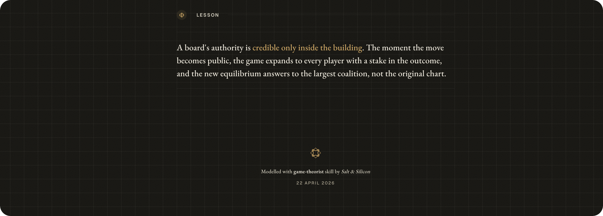

<p align="center">
  
</p>

<h1 align="center">game-theorist</h1>

<p align="center"><strong>Defence-grade strategic reasoning for any competitive situation.</strong></p>

<p align="center"><em>A skill by <a href="https://saltsilicon.com">Salt &amp; Silicon</a></em></p>

---

A skill for AI coding agents. It installs a veteran deterrence strategist into your session.
Describe a situation, negotiation, pricing war, market entry, partnership, fundraising, salary talk,
co-founder split, and the model gets constructed phase by phase, through dialogue.

Works with Claude Code, Codex, Gemini CLI, Cursor, Windsurf, and Cline.

---

## What it does

Most strategic advice jumps to conclusions. This skill refuses to.

Six phases, one at a time:

1. **Phase 1: Deconstruction**, what game is being played? (often different from what you think)
2. **Phase 2: Incentive Mapping**, what do the players want, not what they say they want?
3. **Phase 3: Strategy Space**, what moves exist? which are dominated and can be eliminated?
4. **Phase 4: Equilibrium**, what outcome emerges if everyone acts rationally?
5. **Phase 5: Recommendation**, the concrete move, how to make it credible, and what to do if it
   fails
6. **Phase 6: Dynamic Adaptation**, reputation, tit-for-tat, and changing the rules of the game

---

## A full conversation

```
You: I'm raising prices 20%. Main competitor has cheaper infrastructure. They've been matching my
     prices for two years. What happens?

Agent: Phase 1: Deconstruction.

       Sequential game, repeated. You are the Stackelberg leader, they react to your move. Two
       years of matching is a signal: "we will undercut if you diverge." That signal is the
       equilibrium you are about to break.

       Before I map incentives, one question. Their cost structure relative to yours:
       A) They are cheaper to operate
       B) Similar costs, they are matching strategically
       C) You don't know

You: A. Their unit economics are roughly 30% better.

Agent: Phase 2: Incentive Mapping.

       You: stated objective is margin recovery. True objective is testing whether the market will
       absorb a price increase without churn. BATNA: hold price, accept slower margin growth.
       Time horizon: long.

       Them: stated objective is "competitive pricing." True objective, given the cost asymmetry,
       is share capture. They have headroom to undercut you and stay profitable. BATNA: continue
       matching at current spread.

       Their payoff ranking, in order: (1) you raise, they hold, they capture price-sensitive
       churn. (2) you raise, they raise less, both make more. (3) status quo. (4) price war.

       Your raise creates option 1 for them by default. That is the move you are walking into.

You: So I shouldn't raise?

Agent: Phase 3: Strategy Space.

       Your moves: raise 20% across the board, raise 20% on new customers only, segment the
       product and raise on the premium tier, hold.

       "Raise across the board" is dominated by "raise on new customers only" in your situation.
       Same upside, no churn risk on existing accounts who anchor on $200.

       "Segment and raise on premium" is the strongest. It moves the conversation from price to
       tier, which neutralises their cost advantage. They cannot undercut a tier they don't have.

       Phase 4: Equilibrium.

       If you raise on new customers + introduce a premium tier: they have no clean response. Match
       the new pricing? Their existing customers get angry. Build a premium tier? That is a
       6-month product investment, not a price move. Most likely outcome: they hold, you capture
       margin on new logos, premium tier defines a segment they cannot enter cheaply.

       Phase 5: Recommendation.

       Primary move: keep $200 for existing, $240 for new, launch a $400 premium tier with two
       differentiated features.

       Commitment device: announce the premium tier publicly with a customer logo. This makes the
       segmentation credible and signals you are not just raising prices, you are restructuring.

       Contingency: if they launch a competing premium tier within 6 months, you have your answer
       on their cost structure (they were lying about the asymmetry). Re-run Phase 1.

       Timing: announce premium first, raise new-customer pricing 30 days later. The premium
       launch reframes the price increase as a portfolio move, not a desperate margin grab.
```

That is the loop. You answer, the analyst integrates, moves to the next phase. No generic advice. No
"it depends". A specific recommendation with explicit conditions.

---

## What the analysis looks like

The analysis runs in your terminal as a structured dialogue. When all six phases are complete, the
skill generates a self-contained HTML artefact — a designed document with one section per phase,
themed to the situation. No extra prompt needed.

<p align="center">
  
  
</p>
<p align="center">
  
  
</p>

Full exported artefact: [`examples/analysis-example.html`](./examples/analysis-example.html), the
November 2023 OpenAI board crisis run through all six phases.

---

## Install

Pick your agent. One command.

| Agent           | Install                                                                                                           |
| --------------- | ----------------------------------------------------------------------------------------------------------------- |
| **Claude Code** | `claude plugin marketplace add saltandsilicon/game-theorist && claude plugin install game-theorist@game-theorist` |
| **Codex**       | `npx skills add saltandsilicon/game-theorist -a codex`                                                            |
| **Gemini CLI**  | `gemini extensions install https://github.com/saltandsilicon/game-theorist`                                       |
| **Cursor**      | `npx skills add saltandsilicon/game-theorist -a cursor`                                                           |
| **Windsurf**    | `npx skills add saltandsilicon/game-theorist -a windsurf`                                                         |
| **Cline**       | `npx skills add saltandsilicon/game-theorist -a cline`                                                            |
| **Any other**   | `npx skills add saltandsilicon/game-theorist`                                                                     |

Install once. Invoke with `/game-theorist` or describe a strategic situation.

### Manual install (if you prefer)

```bash
git clone https://github.com/saltandsilicon/game-theorist.git
cp -r game-theorist/skills/game-theorist ~/.claude/skills/
```

For Cursor, copy the rule file:

```bash
cp game-theorist/.cursor/rules/game-theorist.mdc .cursor/rules/
```

For agents that use markdown imports (Cline, etc.), reference the skill from your config:

```
@./skills/game-theorist/SKILL.md
```

## When to use it

### Business

| Situation                          | What the model surfaces                                                                               |
| ---------------------------------- | ----------------------------------------------------------------------------------------------------- |
| Pricing against a competitor       | Whether you are in a zero-sum price war or a coordination game, and which move breaks the equilibrium |
| Negotiating a deal                 | The other party's true BATNA, which concessions cost you nothing but signal value to them             |
| Responding to a competitive threat | Whether to retaliate, ignore, or redirect, and what each signals to the market                        |
| Fundraising / term sheet           | The investor's incentive structure, what "we're still interested" means, when to create urgency       |
| Partnership or M&A                 | Whether this is a positive-sum deal or one player extracting value from the other                     |
| Hiring a key person                | What the candidate's outside options are, how to structure the offer as a commitment device           |

### Personal

| Situation                       | What the model surfaces                                                                                    |
| ------------------------------- | ---------------------------------------------------------------------------------------------------------- |
| Salary negotiation              | Your real position, their constraints, whether to anchor high or create a competitive dynamic              |
| Family or relationship conflict | That it is a repeated game (it almost always is), each party's true incentive, how to shift the outcome    |
| Friend group dynamics           | Who the silent players are, what coordination failure looks like, how to make your preferred outcome focal |
| Personal decision with stakes   | Map your own incentives honestly, your BATNA, what commitment device would make you follow through         |
| Co-founder split                | Each side's true contribution and outside option, why "fair" usually means renegotiating later             |

---

## The frameworks

Eight core frameworks, each matched to a situation type. Full reference:
[`docs/frameworks.md`](docs/frameworks.md).

| Situation                                       | Framework                                        |
| ----------------------------------------------- | ------------------------------------------------ |
| Two parties, conflicting interests, one outcome | Prisoner's Dilemma / Zero-sum                    |
| Negotiation over a deal                         | Nash bargaining solution                         |
| Market entry / competitive threat               | Stackelberg leader-follower                      |
| Coordination needed (standards, platforms)      | Coordination game, focal points                  |
| Auction / bidding                               | Auction theory (winner's curse, optimal bidding) |
| Deterrence / threat credibility                 | Signalling, commitment devices                   |
| Long-term relationship                          | Repeated game, reputation equilibria             |
| Coalition building                              | Cooperative game theory, Shapley value           |

---

## More examples

Four worked case studies, each running through all six phases:
[`docs/examples.md`](docs/examples.md).

- SaaS pricing war
- Investor term sheet, two VCs interested
- Key employee counter-offer
- Partnership revenue share

---

## Resources

Books, papers, and courses that informed this skill: [`docs/resources.md`](docs/resources.md).

### A note on sources

This skill grew out of personal notes collected over the years inside an Obsidian vault. The
attributions are not always traceable, the underlying material is everywhere: Schelling, Nash,
Axelrod, Dixit and Nalebuff, plus countless YouTube lectures, blog posts, Cold War docs, and podcast
episodes that shaped how the framework eventually settled. Treat the resources page as a starting
point, not a citation list.

---

## Files

```
game-theorist/
├── skills/game-theorist/SKILL.md   Source of truth, only edit this
├── docs/
│   ├── frameworks.md               Eight frameworks explained with examples
│   ├── resources.md                Books, papers, courses
│   └── examples.md                 Worked case studies
├── CLAUDE.md                       Claude Code reference
├── GEMINI.md                       Gemini CLI reference
├── AGENTS.md                       Codex reference
├── .clinerules                     Cline reference
├── .cursor/rules/                  Cursor rule (.mdc format)
├── .cursor/skills/                 Cursor skill copy (auto-synced)
├── .windsurf/skills/               Windsurf skill (auto-synced)
└── .github/workflows/sync-skill.yml  Auto-syncs SKILL.md to Cursor and Windsurf
```

The `.github/workflows/sync-skill.yml` workflow propagates any change to
`skills/game-theorist/SKILL.md` to all agent-specific locations on every push to main. Edit one
file, every tool stays in sync.

---

## Contributing

See [`CONTRIBUTING.md`](CONTRIBUTING.md). All changes go through `skills/game-theorist/SKILL.md`.
Never edit the auto-generated copies directly.

---

## Licence

MIT
