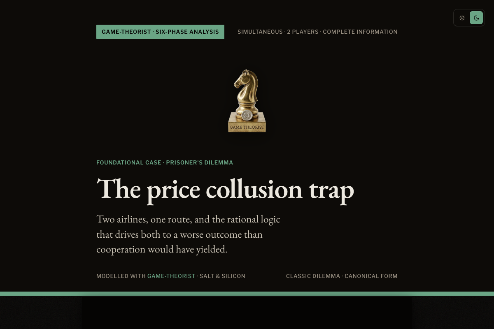
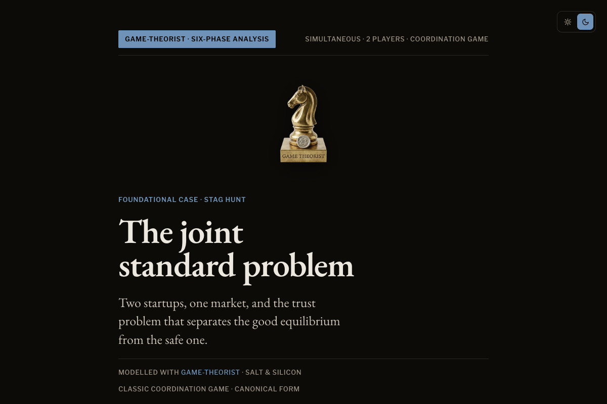
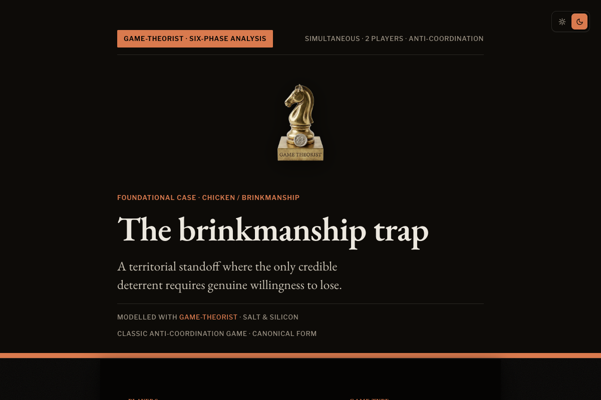

<p align="center">
  
</p>

<h1 align="center">game-theorist</h1>

<p align="center"><strong>Model the other player's next move before you make yours.</strong></p>

<p align="center"><em>A skill by <a href="https://saltsilicon.com">Salt &amp; Silicon</a></em></p>

---

Game theory for strategy, negotiation, pricing, fundraising, partnerships, and competitive
decisions. Describe the situation. The skill turns it into a six-phase strategic model through
dialogue.

Designed for humans using AI assistants. The assistant asks structured questions, maps incentives,
tests likely responses, and ends with a concrete move.

This is a reasoning aid, not an oracle. It can miss context, overfit the framing you give it, or
sound more confident than it should. Use it to learn the concepts, pressure-test incentives, and
structure your thinking. Bring your own judgement before acting. Please do not cheat on your
soulmate because a markdown file told you to.

---

## Install

Pick your agent. Run one command.

| Agent           | Install                                                                                                           |
| --------------- | ----------------------------------------------------------------------------------------------------------------- |
| **Claude Code** | `claude plugin marketplace add saltandsilicon/game-theorist && claude plugin install game-theorist@game-theorist` |
| **Codex**       | `npx skills add saltandsilicon/game-theorist -a codex`                                                            |
| **Cursor**      | `npx skills add saltandsilicon/game-theorist -a cursor`                                                           |
| **Windsurf**    | `npx skills add saltandsilicon/game-theorist -a windsurf`                                                         |
| **Cline**       | `npx skills add saltandsilicon/game-theorist -a cline`                                                            |
| **Any other**   | `npx skills add saltandsilicon/game-theorist`                                                                     |

Install once. Invoke with `/game-theorist` or describe a strategic situation.

### Manual install

```bash
git clone https://github.com/saltandsilicon/game-theorist.git
cp -r game-theorist/skills/game-theorist ~/.claude/skills/
```

For tools that load markdown instructions directly, point them at:

```
@./skills/game-theorist/SKILL.md
```

---

## What is game theory?

Game theory is the study of decisions where other people can react.

It asks simple questions:

- Who are the players?
- What does each player want?
- What can each player do?
- What happens if everyone acts in their own interest?
- Which move changes the game in your favour?

You use it when advice like "just raise prices", "just negotiate harder", or "just wait" is too flat
because someone else can answer your move.

---

## What this skill does

Strategic decisions get hard when another player can react. This skill slows the analysis down:
players first, incentives second, moves third, equilibrium fourth, recommendation last.

Six phases, one at a time:

1. **Phase 1: Deconstruction**, what game is being played? (often different from what you think)
2. **Phase 2: Incentive Mapping**, what do the players want, not what they say they want?
3. **Phase 3: Strategy Space**, what moves exist? which are dominated and can be eliminated?
4. **Phase 4: Equilibrium**, what outcome emerges if everyone acts rationally?
5. **Phase 5: Recommendation**, the concrete move, how to make it credible, and what to do if it
   fails
6. **Phase 6: Dynamic Adaptation**, reputation, tit-for-tat, and changing the rules of the game

---

## A full conversation

```
You: I'm raising prices 20%. Main competitor has cheaper infrastructure. They've been matching my
     prices for two years. What happens?

Agent: Phase 1: Deconstruction.

       Sequential game, repeated. You are the Stackelberg leader, they react to your move. Two
       years of matching is a signal: "we will undercut if you diverge." That signal is the
       equilibrium you are about to break.

       Before I map incentives, one question. Their cost structure relative to yours:
       A) They are cheaper to operate
       B) Similar costs, they are matching strategically
       C) You don't know

You: A. Their unit economics are roughly 30% better.

Agent: Phase 2: Incentive Mapping.

       You: stated objective is margin recovery. True objective is testing whether the market will
       absorb a price increase without churn. BATNA: hold price, accept slower margin growth.
       Time horizon: long.

       Them: stated objective is "competitive pricing." True objective, given the cost asymmetry,
       is share capture. They have headroom to undercut you and stay profitable. BATNA: continue
       matching at current spread.

       Their payoff ranking, in order: (1) you raise, they hold, they capture price-sensitive
       churn. (2) you raise, they raise less, both make more. (3) status quo. (4) price war.

       Your raise creates option 1 for them by default. That is the move you are walking into.

You: So I shouldn't raise?

Agent: Phase 3: Strategy Space.

       Your moves: raise 20% across the board, raise 20% on new customers only, segment the
       product and raise on the premium tier, hold.

       "Raise across the board" is dominated by "raise on new customers only" in your situation.
       Same upside, no churn risk on existing accounts who anchor on $200.

       "Segment and raise on premium" is the strongest. It moves the conversation from price to
       tier, which neutralises their cost advantage. They cannot undercut a tier they don't have.

       Phase 4: Equilibrium.

       If you raise on new customers + introduce a premium tier: they have no clean response. Match
       the new pricing? Their existing customers get angry. Create a premium tier? That is a
       6-month product investment, not a price move. Most likely outcome: they hold, you capture
       margin on new logos, premium tier defines a segment they cannot enter cheaply.

       Phase 5: Recommendation.

       Primary move: keep $200 for existing, $240 for new, launch a $400 premium tier with two
       differentiated features.

       Commitment device: announce the premium tier publicly with a customer logo. This makes the
       segmentation credible and signals you are restructuring, rather than only raising prices.

       Contingency: if they launch a competing premium tier within 6 months, you have your answer
       on their cost structure (they were lying about the asymmetry). Re-run Phase 1.

       Timing: announce premium first, raise new-customer pricing 30 days later. The premium
       launch reframes the price increase as a portfolio move, not a desperate margin grab.
```

That is the loop. You answer, the skill integrates, then moves to the next phase. The output is a
specific recommendation with explicit conditions.

---

## What the analysis looks like

The analysis runs as a structured dialogue in your terminal. When all six phases are complete, the
skill generates a self-contained HTML artefact: a designed document with one section per phase,
themed to the situation.

<p align="center">
  
  
  
</p>

<p align="center"><em>Three classic games, each themed to its subject.</em></p>

Full exported artefact:
[analysis example](https://saltandsilicon.github.io/game-theorist/examples/analysis-example.html),
an anonymised board crisis run through all six phases. The three covers above come from canonical
theory examples, each running a classic game through all six phases:

| Example                                                                                                     | Game                                      | Accent       |
| ----------------------------------------------------------------------------------------------------------- | ----------------------------------------- | ------------ |
| [Prisoner's Dilemma](https://saltandsilicon.github.io/game-theorist/examples/theory-prisoners-dilemma.html) | Two airlines on a pricing standoff        | Forest green |
| [Stag Hunt](https://saltandsilicon.github.io/game-theorist/examples/theory-stag-hunt.html)                  | Two startups deciding on a joint standard | Navy blue    |
| [Chicken](https://saltandsilicon.github.io/game-theorist/examples/theory-chicken.html)                      | Two countries in a tariff brinkmanship    | Burnt orange |

## When to use it

### Business

| Situation                          | What the model surfaces                                                                               |
| ---------------------------------- | ----------------------------------------------------------------------------------------------------- |
| Pricing against a competitor       | Whether you are in a zero-sum price war or a coordination game, and which move breaks the equilibrium |
| Negotiating a deal                 | The other party's true BATNA, which concessions cost you nothing but signal value to them             |
| Responding to a competitive threat | Whether to retaliate, ignore, or redirect, and what each signals to the market                        |
| Fundraising / term sheet           | The investor's incentive structure, what "we're still interested" means, when to create urgency       |
| Partnership or M&A                 | Whether this is a positive-sum deal or one player extracting value from the other                     |
| Hiring a key person                | What the candidate's outside options are, how to structure the offer as a commitment device           |

### Personal

| Situation                       | What the model surfaces                                                                                    |
| ------------------------------- | ---------------------------------------------------------------------------------------------------------- |
| Salary negotiation              | Your real position, their constraints, whether to anchor high or create a competitive dynamic              |
| Family or relationship conflict | That it is a repeated game (it almost always is), each party's true incentive, how to shift the outcome    |
| Friend group dynamics           | Who the silent players are, what coordination failure looks like, how to make your preferred outcome focal |
| Personal decision with stakes   | Map your own incentives honestly, your BATNA, what commitment device would make you follow through         |
| Co-founder split                | Each side's true contribution and outside option, why "fair" usually means renegotiating later             |

---

## The frameworks

Eleven core frameworks, each matched to a situation type. Full reference:
[`docs/frameworks.md`](docs/frameworks.md).

| Situation                                                     | Framework                                        |
| ------------------------------------------------------------- | ------------------------------------------------ |
| Fixed pie, one side's gain is the other's loss                | Zero-sum / constant-sum game                     |
| Both could gain by cooperating, but each is tempted to defect | Prisoner's Dilemma (non-zero-sum)                |
| Negotiation over a deal                                       | Nash bargaining solution                         |
| Market entry / competitive threat                             | Stackelberg leader-follower                      |
| Coordination needed (standards, platforms)                    | Coordination game, focal points                  |
| Auction / bidding                                             | Auction theory (winner's curse, optimal bidding) |
| Deterrence / threat credibility                               | Signalling, commitment devices                   |
| Drawing out private info the other side holds                 | Screening (self-selecting menus)                 |
| Long-term relationship                                        | Repeated game, reputation equilibria             |
| Coalition building                                            | Cooperative game theory, Shapley value           |
| Rivals who also enlarge the pie together                      | Co-opetition, Value Net, PARTS                   |

---

## More examples

Fourteen worked case studies, each running through all six phases:
[`examples/worked-examples.md`](examples/worked-examples.md).

- Salary negotiation at a late-stage startup
- Pricing war, B2B SaaS
- Fundraising, two term sheets
- Co-founder equity split, revisited at Series A
- Market entry against a funded incumbent
- Partnership with unequal power
- Single-source supplier renegotiation
- Exit negotiation, acquirer under time pressure
- Enterprise buyer herding, breaking an information cascade
- Founder afraid to pivot on a lead investor, reputational lock-in
- Competitor lobbying a regulator, regulatory framing shift
- Public pricing and patent standoff, mutual escalation lock
- Doubling down on a failing build, sunk cost trap
- A repeated game misread as one-shot

---

## Resources

Books, papers, courses, and tools that informed this skill:
[`docs/resources.md`](docs/resources.md).

### A note on sources

This skill grew out of personal notes collected over the years in an Obsidian vault. The
attributions are not always traceable, the underlying material is everywhere: Schelling, Nash, plus
countless YouTube lectures, blog posts, Cold War docs, and podcast episodes that shaped how the
framework eventually settled. There is also an X thread I could not find again, where someone posted
a game-theory prompt that inspired this skill at roughly 70-80%. If the author finds this, please
reach out and I will credit you. Treat the resources page as a starting point, not a citation list.

---

## FAQ

### Is this for humans or agents?

Humans. The skill runs inside an AI assistant, but the point is better human judgement. It gives the
assistant a process for asking questions, mapping incentives, and avoiding instant advice.

### Which assistants does it work with?

Any assistant that can load a markdown skill or instruction file. Use the agent-specific install if
one exists. Otherwise, use the manual markdown import.

### When should I not use it?

Do not use it for pure calculations, one-person decisions, generic copywriting, definitions, or
cosplaying Machiavelli with a terminal. If there is no other actor making choices, use a simpler
tool.

### Can I trust the recommendation?

Treat it as a structured hypothesis. The assistant can sound confident while missing context. Use
the model to see incentives and likely responses, then apply your own judgement. The model can map
the game. It cannot live with the consequences.

---

## Files

```
game-theorist/
├── skills/game-theorist/
│   ├── SKILL.md              Source of truth, only edit this
│   ├── references/           Bundled depth: frameworks, edge-cases, worked-examples, HTML template
│   └── tests/                Evaluation cases + scoring rubric
├── docs/                     Public mirror: frameworks.md, resources.md
├── examples/                 analysis-example.html, theory-*.html, worked-examples.md, edge-cases.md
├── demos/                    Full six-phase conversation transcripts
├── assets/                   Branding + screenshots
├── CLAUDE.md / AGENTS.md / GEMINI.md / .clinerules   Per-agent reference docs
├── .cursor/ + .windsurf/     Auto-synced skill copies (never edit directly)
└── .github/workflows/        Validation, examples deployment, and skill sync
```

The `.github/workflows/sync-skill.yml` workflow propagates any change to
`skills/game-theorist/SKILL.md` to all agent-specific locations on every push to main. Edit one
file, every tool stays in sync.

---

## Contributing

Feedback is welcome: better examples, sharper frameworks, broken install reports, weird edge cases,
or critiques of the reasoning flow. This is meant to improve through real use.

See [`CONTRIBUTING.md`](CONTRIBUTING.md) before opening a PR. Behaviour changes go through
`skills/game-theorist/SKILL.md`. Never edit the auto-generated copies directly.

---

## Licence

MIT
